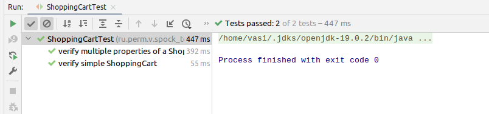
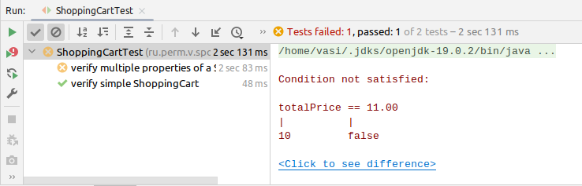

### Groovy Spock

Еще одни интересный скриптовый инструмент benave тестирования.

Пример:

````groovy
class ShoppingCartTest extends Specification {
    def "verify multiple properties of a ShoppingCart"() {
        given:
            ShoppingCart cart = new ShoppingCart()
            cart.addItem("Apple", 3)
            cart.addItem("Banana", 2)

        expect:
            with(cart) {
                totalItems == 5
                totalPrice == 10.00
                items.size()  ==  2
                items.contains(new ShoppingItem("Apple",3))
                items.contains(new ShoppingItem("Banana",2))
            }
    }

````



Проведение теста:

````bash
./mvnw test
````

Результат для проваленного теста:
(Изменил: totalPrice == 11.00)

````
Condition not satisfied:

totalPrice == 11.00
|          |
````



https://www.baeldung.com/groovy-spock